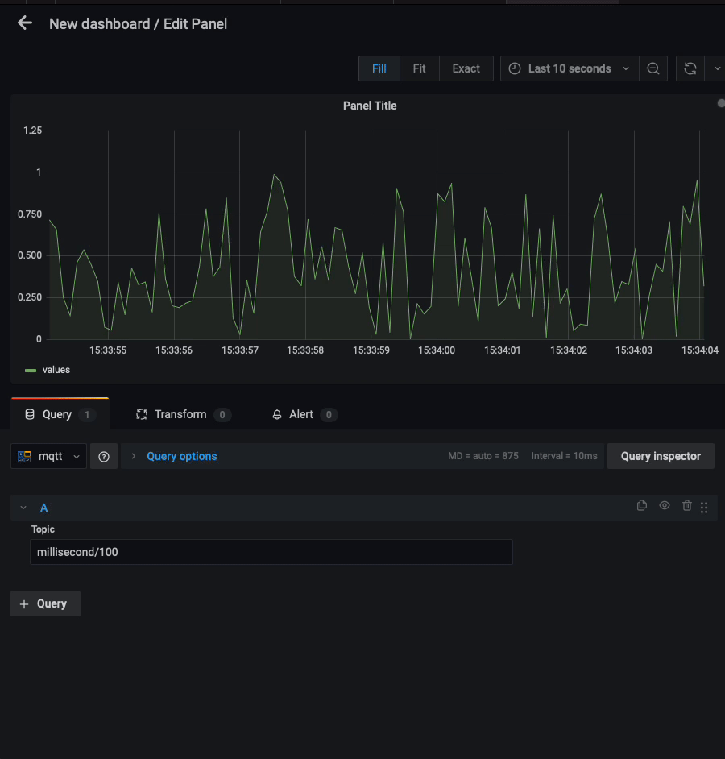

# Contributing to the MQTT Datasource Plugin

## Signed commits are required

> [!IMPORTANT]
> All commits must be [signed](https://docs.github.com/en/authentication/managing-commit-signature-verification/signing-commits) (GPG, SSH, or S/MIME) to be merged into this repository. Pull requests with unsigned commits will need to be re-committed with signatures before they can be merged.

## Prerequisites

- Node.js (v24 or later)
- Go (latest stable version)
- npm (v11.18.0 or later)
- Mage — install after Go is set up:
  ```
  go install github.com/magefile/mage@latest
  ```

## Development Setup

1. Clone the repository
2. Install dependencies:
   ```
   npm install
   ```
3. Build the frontend:
   ```
   npm run build
   ```
4. Build the Go backend:
   ```
   mage build
   ```

## Development Workflow

The recommended way to develop is with Docker Compose, which starts a pre-configured Grafana instance alongside the plugin automatically:

```
npm run server
```

Then, in separate terminals, start the watchers so code changes are picked up live:

```
npm run dev
```

```
mage watch
```

Start test broker:

```
npm run broker
```

This will start a test MQTT broker on `tcp://localhost:1883`.

Start the test broker with TLS:

```
npm run broker:tls
```

This will start a test MQTT broker on `tls://localhost:8883` with TLS enabled. Before running this for the first time, generate the TLS certificates by running:

```
npm run broker:pki
```

This will create the required certificates in the `testdata` folder.

When testing with the test broker you can subscribe to test data streams using the following topic patterns:

- `millisecond/<number>` - emit data every N milliseconds
- `second/<number>` - emit data every N seconds
- `minute/<number>` - emit data every N minutes
- `hour/<number>` - emit data every N hours



After making your changes, ensure checks pass:

```
npm run typecheck  # Check TypeScript types
npm run lint       # Lint the Typescript code
npm run test:ci    # Run tests
npm run spellcheck # Run spellcheck
mage test          # Run Go tests
mage lint          # Lint Go code
```

If you've added new functionality, please add appropriate tests.

## Project Structure

- `src/` - Frontend TypeScript/React code
- `pkg/` - Backend Go code
  - `mqtt/` - MQTT client implementation
  - `plugin/` - Grafana plugin implementation
- `scripts/` - Utility scripts
- `testdata/` - Test certificates and data

## Running Against a Local Grafana Instance

> **Most contributors should use `npm run server` instead.** Docker Compose is the recommended development setup — it starts a pre-configured Grafana instance with no manual setup required.

This section is for the specific case where you already have a Grafana installation running on your machine and want to load the locally-built plugin into it (e.g., you are testing the plugin against a specific Grafana version or configuration that you manage yourself). If that does not describe your situation, use `npm run server` instead.

Clone the repository under Grafana's plugins directory `/var/lib/grafana/plugins`

```
workspace
  |__ grafana
  |__ plugins
    |__ grafana_mqtt_datasource 
```

### 1. Build the plugin

```
npm run build
mage build
```

### 3. Allow the unsigned plugin in Grafana

Local builds are not signed, so you must explicitly permit the plugin in `grafana.ini`:

```ini
[plugins]
allow_loading_unsigned_plugins = grafana-mqtt-datasource
```

### 4. Restart Grafana and verify

Restart the Grafana service, then open the Grafana UI and navigate to **Administration → Plugins** to confirm the MQTT datasource appears and is enabled.

## Submitting PR

If you are creating a PR, ensure to run `npx changeset` from your branch. Provide the details accordingly. It will create `*.md` file inside `./.changeset` folder. Later during the release, based on these changesets, package version will be bumped and changelog will be generated.

## Releasing & Bumping version

To create a new release, execute `npx changeset version`. This will update the Changelog and bump the version in `package.json` file. Commit those changes.
