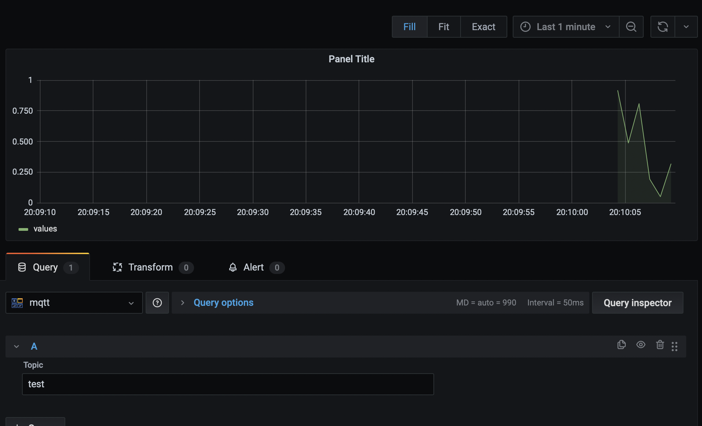

# Grafana MQTT Datasource

## Starting Test MQTT Broker

Add the MQTT datasource to your local Grafana server using the default host and port, and then run:

```
node test_broker
```

You can then add the topic `test` to a graph:


