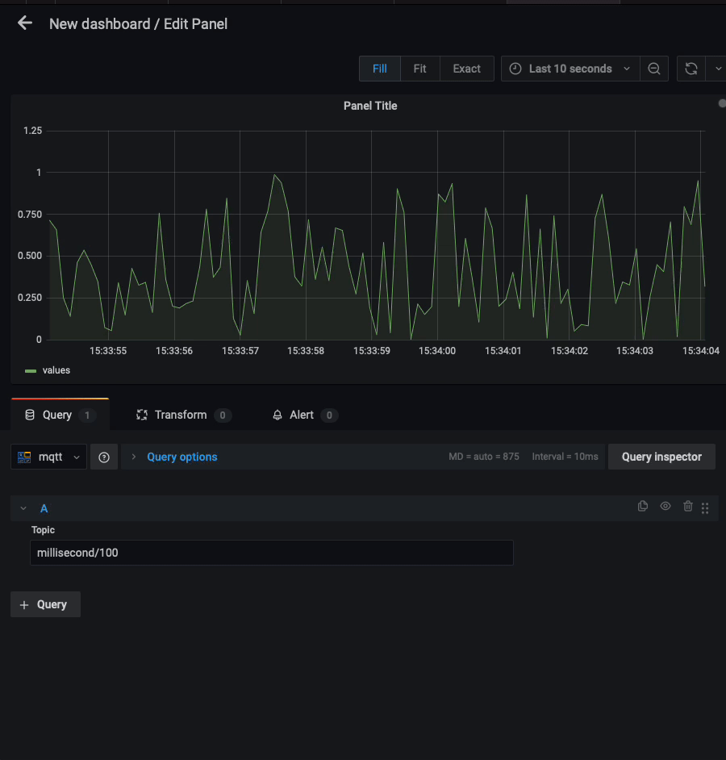

# MQTT data source for Grafana

The MQTT data source plugin allows you to visualize streaming MQTT data from within Grafana.

This datasource is under active development, all feedback and help is encouraged!

## Requirements

The MQTT data source has the following requirements:

- Grafana user with a server or organization administration role; refer to [Permissions](https://grafana.com/docs/grafana/latest/permissions/).
- Access to a MQTT broker.

## Known limitations

- The plugin currently does not support all of the MQTT CONNECT packet options.
- The plugin currently does not support TLS.
- Including multiple topics in a panel is not yet well supported.
- This plugin automatically supports topics publishing json formatted messages.

## Install the plugin

1. Clone the plugin to your Grafana plugins directory.
2. Build the plugin by running `yarn install` and then `yarn build`.
3. Run `mage reloadPlugin` or restart Grafana for the plugin to load.

### Meet compatibility requirements

This plugin currently supports MQTT v3.1.x.

### Verify that the plugin is installed

1. In Grafana from the left-hand menu, navigate to **Configuration** > **Data sources**.
2. From the top-right corner, click the **Add data source** button.
3. Search for `MQTT` in the search field, and hover over the MQTT search result.
4. Click the **Select** button for MQTT.

## Configure the data source

[Add a data source](https://grafana.com/docs/grafana/latest/datasources/add-a-data-source/) by filling in the following fields:

#### Basic fields

| Field | Description                                        |
| ----- | -------------------------------------------------- |
| Name  | A name for this particular AppDynamics data source |
| Host  | The hostname or IP of the MQTT Broker              |
| Port  | The port used by the MQTT Broker (default 1883)    |

#### Authentication fields

| Field    | Description                                                       |
| -------- | ----------------------------------------------------------------- |
| Username | (Optional) The username to use when connecting to the MQTT broker |
| Password | (Optional) The password to use when connecting to the MQTT broker |

## Query the data source

The query editor allows you to specify which MQTT topics the panel will subscribe to. Refer to the [MQTT v3.1.1 specification](http://docs.oasis-open.org/mqtt/mqtt/v3.1.1/os/mqtt-v3.1.1-os.html#_Toc398718106)
for more information about valid topic names and filters.

